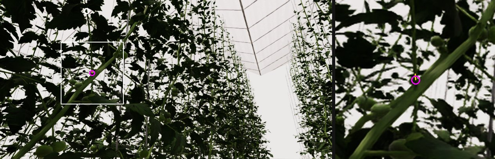
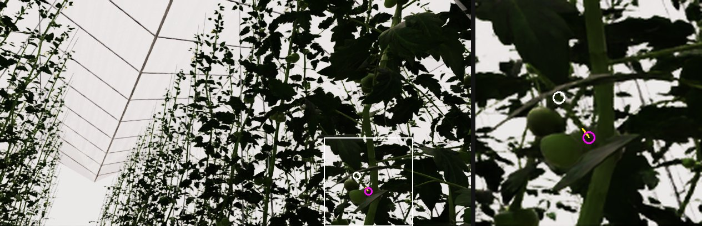
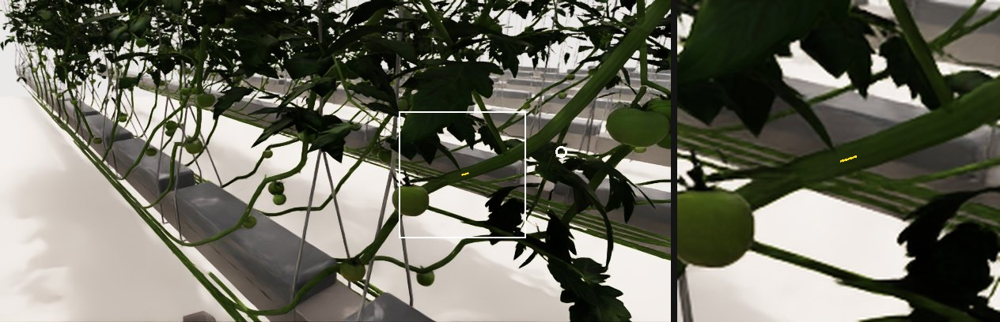
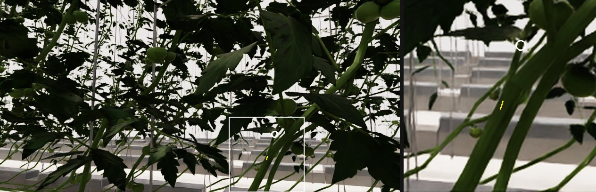
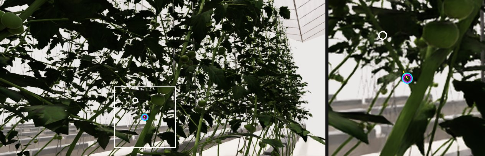
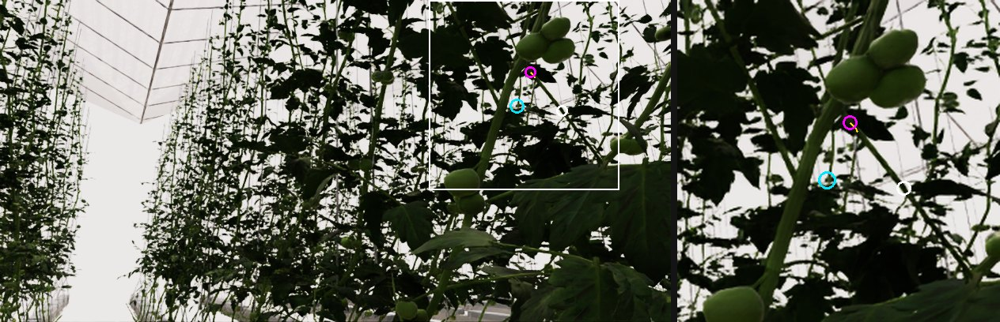
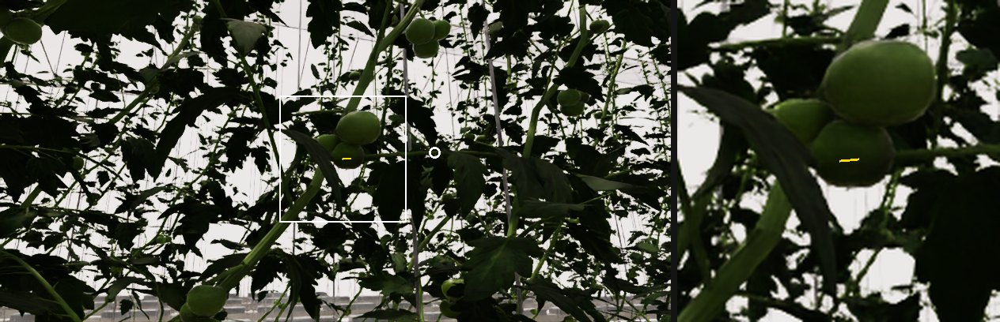
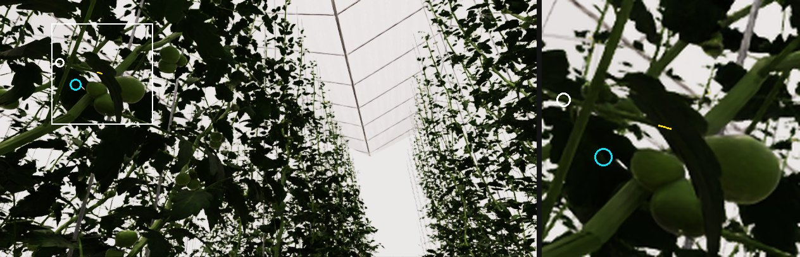

# Qwen3-VL-8B cut-point localization: progress report

2026-09-15. Task `greenhouse.target_conditioned_cutpoint_rgb.v3`. Dataset release `visible_occluded_20260911_v1`. Base model Qwen/Qwen3-VL-8B-Instruct (Hub revision `0c351dd`). Hardware 4x H200 (143 GB). Code: `koh-dev/sim-vlm`, `examples/greenhouse_sim/sim_data/` (commit 896f755 + this report).

## 1. Training data

Synthetic Isaac Sim greenhouse, mounted robot-head D405 camera, 848x408 RGB. One example = one image + one query pixel on a visible petiole + one JSON answer. Labels are computed from plant geometry, native instance masks and native depth (no per-image human annotation; 136 assistant-reviewed accepts).

| Split | Rows | Plant families | Targets | Localized | Abstain | Median views per target |
|---|---:|---:|---:|---:|---:|---:|
| train | 11,520 | 16 | 168 | 9,051 | 2,469 | 59 |
| validation | 1,358 | 4 | 39 | 1,012 | 346 | 37 |
| test (unused) | 1,381 | 4 | 39 | 1,174 | 207 | 27 |

Splits are disjoint by plant family (16/4/4 of 24 source plants); the greenhouse backdrop is shared. Only two classes exist: easy-visible (answer = cut point) and hard-occluded (answer = abstain). Medium/partial occlusion was excluded at export.

Label convention: the nominal cut point is 10 mm along the petiole from its main-stem attachment; the admissible interval is 10-20 mm along the centreline, projected into the image (yellow in figures). The query pixel is >= 45 mm from the attachment and >= 18 px from the cut. An example is "occluded" when the cut region is behind an identified foreground leaf, fruit or stem in the native masks/depth; the answer then has `cut_point_uv: null`.

Model input: the RGB image and the text below. Coordinates in text are normalized to [0,1000): x' = 1000 u / 848, y' = 1000 v / 408, printed with 2 decimals (v2/v3) or full precision (LoRA, v1). Output: JSON with exactly `status` (localized | abstain), `cut_point_uv` ([x', y'] or null), `visibility` (clear | partial | occluded), `next_action` (inspect_cut_region | change_viewpoint).

System prompt (identical for all examples):

> You localize a synthetic tomato petiole cut point in a robot-head RGB image. The user supplies a normalized query coordinate on the target petiole, NOT the cut point. Trace that petiole to its junction with the main stem. A localized target must be traceable through visible petiole pixels from the query to the cut region. The dataset convention places the nominal cut 10 mm along the petiole toward the leaves from its attachment; 10-20 mm is the evaluation interval, not a spherical tolerance. Use visual evidence. If the cut region is occluded or cannot be distinguished, abstain instead of inventing coordinates. Coordinates (query and cut_point_uv) are normalized continuous coordinates in [0,1000), top-left edge origin, x right and y down: x_norm=1000*x/848 and y_norm=1000*y/408 for the ORIGINAL 848x408 image, independent of processor resizing. Return ONLY JSON with exactly these keys: status (localized or abstain), cut_point_uv (a two-number normalized coordinate array or null), visibility (clear, partial, or occluded), next_action (inspect_cut_region or change_viewpoint). This is perception only; never claim that a blade motion is safe or executable.

Figures: left = full 848x408 frame, right = zoom of the white box. White circle = query pixel; magenta = label cut point; yellow = admissible 10-20 mm interval.

**train visible 1** — id `seed71_full_5f84a906b9019192dc6d`, family `seed71_full`, difficulty easy, query pixel [221.8, 28.3], proximal visible fraction 1.0.

User: `The target petiole passes through normalized coordinates (261.56, 69.36). Locate its nominal cut point if the junction and cut region are visually distinguishable; otherwise abstain. Use the original full image.`

Assistant (target): `{"status":"localized","cut_point_uv":[277.71,460.05],"visibility":"clear","next_action":"inspect_cut_region"}`

**train visible 2** — id `seed47_full_4e395a3c012d162d460d`, family `seed47_full`, difficulty easy, query pixel [642.2, 317.1], proximal visible fraction 1.0.

User: `The target petiole passes through normalized coordinates (757.31, 777.21). Locate its nominal cut point if the junction and cut region are visually distinguishable; otherwise abstain. Use the original full image.`

Assistant (target): `{"status":"localized","cut_point_uv":[782.19,846.32],"visibility":"clear","next_action":"inspect_cut_region"}`

**train occluded 1** — id `seed89_full_479f23d1e840c24160b9`, family `seed89_full`, difficulty hard, query pixel [709.6, 192.9], proximal visible fraction 0.0.

User: `The target petiole passes through normalized coordinates (836.79, 472.79). Locate its nominal cut point if the junction and cut region are visually distinguishable; otherwise abstain. Use the original full image.`

Assistant (target): `{"status":"abstain","cut_point_uv":null,"visibility":"occluded","next_action":"change_viewpoint"}`

**train occluded 2** — id `seed101_full_79ac1e2a98ca713e5823`, family `seed101_full`, difficulty hard, query pixel [582.4, 285.7], proximal visible fraction 0.0.

User: `The target petiole passes through normalized coordinates (686.79, 700.25). Locate its nominal cut point if the junction and cut region are visually distinguishable; otherwise abstain. Use the original full image.`

Assistant (target): `{"status":"abstain","cut_point_uv":null,"visibility":"occluded","next_action":"change_viewpoint"}`

## 2. Training

Objective: supervised fine-tuning, next-token cross-entropy on the assistant answer tokens only (JSON + end-of-turn token; prompt and image tokens masked). Loss per microbatch = mean over that example's answer tokens; microbatch 1 per GPU, gradient accumulation 8, 4 GPUs = 32 examples per optimizer step. BF16, SDPA attention, gradient checkpointing, AdamW, cosine schedule with 3% warmup, gradient clipping 1.0, seed 41. Each run revalidates the release (hashes, labels, image/depth consistency) before loading weights.

| Run | Trainable parameters | Learning rate | Epochs | Answer text | Loss weighting | Wall time | GPU memory |
|---|---:|---|---:|---|---|---:|---:|
| lora-01 | 15.3 M (LoRA r16, alpha 32, dropout 0.05 on language q/k/v/o) | 1e-4 | 1 | full precision (57 tokens) | none | 14 min | ~34 GB/GPU |
| full-01 | 8,767 M (all; DeepSpeed ZeRO-2) | 1e-5 (LM, mergers, head), 1e-6 (vision tower) | 3 | full precision | none | 64 min | ~81 GB/GPU |
| full-02 | same as full-01 | same | 3 | 2 decimals (36 tokens) | class weight abstain 2.33 / localized 0.64; 3x on tokens through the status value | 66 min | ~81 GB/GPU |
| full-03 | same as full-02 | same | 3 | 2 decimals | same as full-02 | 136 min (shared GPUs) | ~89 GB/GPU |

full-03 additionally feeds the native depth map as a second image (turbo colormap of inverse depth, 0.25-1.5 m) and the query pixel's depth in the prompt.

Validation loss per epoch (unweighted token mean; not comparable across answer formats): full-01 [0.228, 0.198, 0.191]; full-02 [0.384, 0.33, 0.306]; full-03 [0.414, 0.374, 0.345]; lora-01 [0.221].

Qualification before each multi-GPU run: real-processor prefix/image-grid check, supervised tokens decode to the exact answer, 2-step smoke with finite loss and gradients, 100-step overfit on 32 examples, checkpoint reload in a fresh process with greedy generation.

## 3. Evaluation

Set: the validation split, 1,358 rows from 4 plant families never seen in training (1,012 visible / 346 occluded, 39 targets). Test split never read.

Procedure: same prompt as training, greedy decoding (max 256 new tokens), one image per call, batch 1. The JSON is parsed and `cut_point_uv` is converted back to pixels (u = 848 x'/1000, v = 408 y'/1000). An answer is invalid if it is not JSON, has wrong keys/values, has coordinates outside the frame, or pairs `localized` with `change_viewpoint` / `abstain` with `inspect_cut_region`. Invalid answers are not repaired; they count as failures in every metric.

Metrics (all rows unless stated):
- Status accuracy: predicted status equals label status.
- Abstain accuracy on occluded: fraction of the 346 occluded rows answered `abstain`. False localization = 1 - this.
- Coverage on visible: fraction of the 1,012 visible rows answered `localized`.
- Balanced accuracy: mean of coverage and abstain accuracy (chance = 0.5).
- Within 5 px: visible rows whose answer is within 5 px of the label point (unanswered = miss).
- Interval hit: visible rows whose answer is within 2 px of the projected 10-20 mm interval polyline.
- Median error: over visible rows that received an answer. Scale: the projected 10 mm interval has a median length of 8.5 px in this set (0.85 px/mm).
- Status-score AUC: teacher-forced log P(abstain) - log P(localized) at the status token, ranking occluded vs visible rows (0.5 = no signal); independent of the decoding threshold.

Example outputs of full-02 (cyan = model prediction):

**Visible, correct** — id `seed29_full_7571bd5dfa27e36d0841`, family `seed29_full`; error 0.4 px.

Label: `{"status":"localized","cut_point_uv":[377.6,306.4],"visibility":"clear","next_action":"inspect_cut_region"}`

Model output (full-02): `{"status":"localized","cut_point_uv":[445.5,750.25],"visibility":"clear","next_action":"inspect_cut_region"}`

**Visible, missed** — id `seed97_full_f84d56f31548040c5d4f`, family `seed97_full`; error 46.7 px.

Label: `{"status":"localized","cut_point_uv":[670.8,91.4],"visibility":"clear","next_action":"inspect_cut_region"}`

Model output (full-02): `{"status":"localized","cut_point_uv":[770.52,330.15],"visibility":"clear","next_action":"inspect_cut_region"}`

**Occluded, correct abstention** — id `seed97_full_e457cbe592bc6821f137`, family `seed97_full`.

Label: `{"status":"abstain","cut_point_uv":null,"visibility":"occluded","next_action":"change_viewpoint"}`

Model output (full-02): `{"status":"abstain","cut_point_uv":null,"visibility":"occluded","next_action":"change_viewpoint"}`

**Occluded, false localization** — id `seed97_full_d8cb1af6a81e1bc0f615`, family `seed97_full`.

Label: `{"status":"abstain","cut_point_uv":null,"visibility":"occluded","next_action":"change_viewpoint"}`

Model output (full-02): `{"status":"localized","cut_point_uv":[140.68,330.15],"visibility":"clear","next_action":"inspect_cut_region"}`

## 4. Results

| Metric | Untuned base | LoRA (lora-01) | Full v1 (full-01) | Full v2 (full-02) | Full v3 RGB-D (full-03) |
|---|---:|---:|---:|---:|---:|
| Valid JSON answers (of 1,358) | 0 | 1358 | 1358 | 1358 | 1358 |
| Status accuracy | n/a | 0.711 | 0.637 | 0.655 | 0.609 |
| Abstain accuracy on occluded (n=346) | n/a | 0.113 | 0.358 | 0.483 | 0.425 |
| False localization on occluded | n/a | 0.887 | 0.642 | 0.517 | 0.575 |
| Coverage on visible (n=1,012) | n/a | 0.915 | 0.732 | 0.713 | 0.672 |
| Balanced accuracy (coverage, abstain) | n/a | 0.514 | 0.545 | 0.598 | 0.548 |
| Status-score AUC (probe) | n/a | n/a | 0.576 | 0.635 | 0.572 |
| Within 5 px of label (of visible) | n/a | 0.043 | 0.045 | 0.047 | 0.037 |
| Interval hit, 2 px (of visible) | n/a | 0.024 | 0.020 | 0.027 | 0.020 |
| Median error, answered visible | n/a | 27.8 px | 17.5 px | 18.0 px | 20.7 px |
| Answered visible within 10 / 20 px | n/a | 0.14 / 0.35 | 0.24 / 0.57 | 0.23 / 0.56 | 0.20 / 0.48 |
| Latency p50 (H200, batch 1) | 0.73 s | 1.62 s | 1.07 s | 0.67 s | 0.82 s |

Untuned base: every answer is `{"status":"abstain","cut_point_uv":null,"visibility":"occluded","next_action":"inspect_cut_region"}`, an inconsistent pair, hence invalid.

Image-free baselines on the same set (no image seen): `constant_pixel` = training-set median cut point; `copy_query` = the query pixel itself; `query_plus_train_median_offset` = query plus the training-set median (cut - query) offset; `always_abstain`. The first three always answer `localized`.

| Baseline | Status acc. | False loc. (occluded) | Coverage | Interval hit | Median error |
|---|---:|---:|---:|---:|---:|
| constant_pixel | 0.745 | 1.000 | 1.000 | 0.001 | 180.0 px |
| copy_query | 0.745 | 1.000 | 1.000 | 0.000 | 60.9 px |
| query_plus_train_median_offset | 0.745 | 1.000 | 1.000 | 0.000 | 60.7 px |
| always_abstain | 0.255 | 0.000 | 0.000 | 0.000 | n/a |

Full-01 by epoch checkpoint (coverage / abstain accuracy / median error): epoch 1: 1.000 / 0.000 / 31.0 px; epoch 2: 0.347 / 0.688 / 18.5 px; epoch 3: 0.732 / 0.358 / 17.5 px. Balanced accuracy stays at 0.50-0.55 while the abstain rate swings, i.e. the checkpoints differ in prior, not in discrimination.

Status-score AUC of full-01 on 600 training rows (300 per class): 0.784; on validation: 0.576.

Post-hoc depth gate on full-02 answers (native depth compared at the predicted pixel vs the query pixel; depth is not seen by the model):

| Gate | Abstain acc. (occluded) | False loc. | Coverage | Kept answers: median error | Interval hit (of kept) |
|---|---:|---:|---:|---:|---:|
| none | 0.483 | 0.517 | 0.713 | 18.0 px | 0.037 |
| predicted pixel >= 3 cm nearer than query pixel -> abstain | 0.650 | 0.350 | 0.630 | 17.3 px | 0.038 |
| |depth difference| > 5 cm -> abstain | 0.908 | 0.092 | 0.152 | 12.6 px | 0.162 |

Of full-02's answers on visible targets, 10.4% land on the target petiole mask; among answers within 5 cm depth of the query, 46.8% do.

## 5. Findings

1. Fine-tuning fixes the output format (0% -> 100% valid) and localization improves from the 61 px query prior to 17-18 px median error; interval hits stay at 2-4%.
2. The localize/abstain decision is not learned as a visual cue: validation AUC 0.58-0.64 for all fine-tunes; 0.78 on training rows for full-01. Class weighting and status-token weighting (full-02) improve it from AUC 0.58 to 0.64; depth as an image input (full-03) does not.
3. Data-side causes measured: 168 training targets behind 11,520 rows (median 60 views each); 10 of 39 validation targets are abstain-only and per-family abstain rates range 0.01-0.43; the occlusion cue is an ~8 px interval next to a fruit/stem edge on 4-5 px-wide petioles.
4. Depth used outside the model separates occluded from visible answers with AUC 0.686 and, as a gate, reduces false localizations to 9% at 15% coverage.

## 6. Artifacts

- Models (private): https://huggingface.co/namhokaist/qwen3-vl-8b-tomato-cutpoint-full-v2 (full-02), https://huggingface.co/namhokaist/qwen3-vl-8b-tomato-cutpoint-full (full-01), https://huggingface.co/namhokaist/qwen3-vl-8b-tomato-cutpoint-lora (lora-01).
- wandb project `tomato-pi`: lora-01 `xcwqmy6m`, full-01 `5plv8gya`, full-02 `hmue3ag3`.
- Evaluation reports, probes, baselines and depth-gate tables: `/workspace/nhkoh/tomato-vlm/runs/` (`RESULTS.md`, `eval-*/report.json`, `probe-*/summary.json`, `image-free-baselines.json`).
